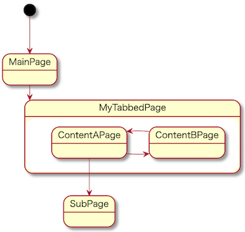
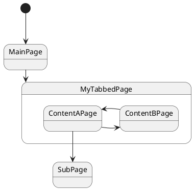
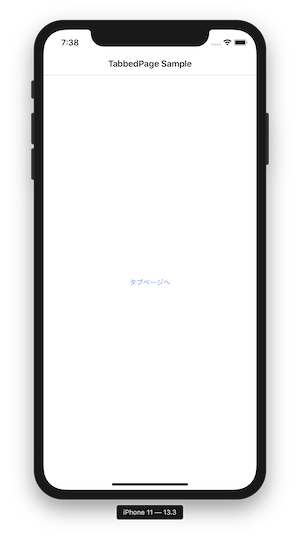
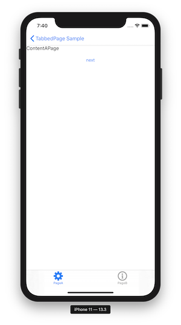
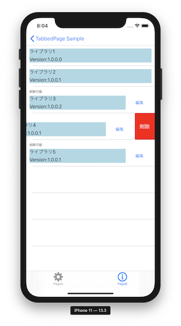
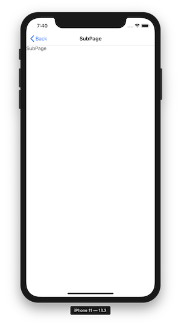

# TabbedPageSample

Xamarin.Forms + Prism のTabbedPageサンプルです。 
TabbedPageの他に以下も使用しています。 

* ListView
* DataTemplateSelectorによるListViewの行データによるレイアウト切り替え。
* MenuItemによるListViewの行削除。
* ControlTemplateによるXAMLの部品化。

## 画面遷移図

### MainPage
TabbedPageに遷移する画面。 

### MyTabbedPage - ContentAPage

TabbedPageのタブ1つ目。 

### MyTabbedPage - ContentBPage

TabbedPageのタブ2つ目。 

 
* DataTemplateSelectorを使って、データにあわせてListViewの行表示・コンテキストメニュー有無を切り替え。
* MenuItemでコンテキストメニューを表示。削除メニューで行を削除。
* ControlTemplateによるXAMLの部品化。背景が薄い群青色のエリアが部品化したエリア。

### SubPage

